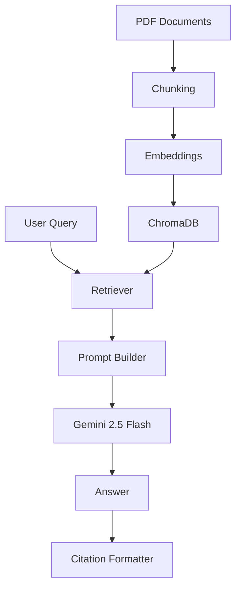

# Explainable Multi-Document RAG System

<div align="center">


</div>

<div align="center">

<h3>🧠 A production-inspired, explainable Retrieval-Augmented Generation system for multi-document question answering.</h3>

<p><strong>Built for recruiters, AI engineers, internship reviewers, and developers who want to see how grounded LLM applications are engineered end to end.</strong></p>

</div>

---

## 🌟 Project Overview

This project demonstrates how a modern RAG pipeline can be built incrementally using practical AI engineering patterns. It ingests multiple PDF documents, splits them into meaningful chunks, stores them in a persistent vector database, retrieves semantically relevant evidence, and generates responses grounded in retrieved context using Gemini 2.5 Flash.

### Why this matters

- Large language models are powerful, but they can hallucinate when asked questions outside their training scope.
- Retrieval-Augmented Generation (RAG) solves this by grounding responses in retrieved evidence.
- This project goes one step further by making the process explainable through citations and a transparent dashboard.

### What this project demonstrates

- Multi-document ingestion and indexing
- Semantic retrieval over vector embeddings
- Prompt construction grounded in retrieved context
- LLM answer generation with evidence-backed responses
- A Streamlit interface for viewing retrieved chunks, prompts, and pipeline insights

---

## ✅ Features

### Implemented

- [x] Multi-document indexing
- [x] Semantic Retrieval
- [x] Persistent Chroma Database
- [x] Prompt Builder
- [x] Gemini Integration
- [x] Grounded Responses
- [x] Citation Support
- [x] Streamlit Dashboard
- [x] Modular Architecture

### Future

- [ ] Hybrid Search
- [ ] Cross Encoder Re-ranking
- [ ] Metadata Filtering
- [ ] Confidence Score
- [ ] Contradiction Detection
- [ ] Conversation Memory
- [ ] Streaming
- [ ] Evaluation Pipeline

---

## 🎬 Demo

<p align="center">
  
</p>

### Demo Placeholders

- 🏗️ Architecture Image: Add a high-quality system diagram under assets/
- 📊 Dashboard Screenshot: Capture the Streamlit UI for the README hero section
- 🔎 Retrieval Example: Show a sample retrieved chunk and answer pair
- 🎞️ GIF: Add a short workflow animation or screen recording

<details>
<summary><strong>View expected demo flow</strong></summary>

1. Upload or load PDFs from the data directory.
2. Chunk and index the content into ChromaDB.
3. Ask a question in the dashboard.
4. Retrieve top-k evidence and generate a grounded answer.
5. Inspect citations and prompt context.

</details>

---

## 🏛️ System Architecture



---

## 🔄 Workflow

| Stage | Purpose | Input | Output |
|---|---|---|---|
| PDF Loading | Read source documents from disk | PDF files in data/ | LangChain documents |
| Chunking | Split long documents into meaningful segments | Raw document pages | Smaller context chunks |
| Embeddings | Convert chunks into dense vector representations | Chunked text | Embedding vectors |
| Vector Database | Persist and query embeddings efficiently | Embedded chunks | ChromaDB collection |
| Semantic Retrieval | Find relevant evidence for a user question | Query text | Top-k retrieved chunks |
| Prompt Builder | Assemble grounded context for the LLM | Query + retrieved chunks | Structured prompt |
| LLM Generation | Produce an answer from retrieved evidence | Grounded prompt | Final answer |
| Citation Formatting | Attach supporting evidence to the answer | Answer + retrieved chunks | Explainable response |

---

## 📁 Folder Structure

```text
.
├── app.py                     # Streamlit dashboard entry point
├── requirements.txt          # Python dependencies
├── README.md                  # Project documentation
├── data/                      # Source PDF documents
├── chroma_db/                 # Persistent vector store artifacts
├── scripts/
│   └── check.py               # Sanity check utilities
└── src/
    ├── main.py                # End-to-end CLI pipeline runner
    ├── citations/
    │   └── formatter.py       # Citation formatting logic
    ├── embeddings/
    │   └── vector_store.py   # ChromaDB indexing and persistence
    ├── llm/
    │   └── generator.py       # Gemini API integration
    ├── loaders/
    │   └── pdf_loader.py      # PDF ingestion
    ├── processors/
    │   └── text_splitter.py   # Chunking logic
    ├── prompts/
    │   └── prompt_template.py # Grounded prompt construction
    └── retrievers/
        └── semantic_retriever.py
```

### Responsibility Summary

- [app.py](app.py): Renders the interactive Streamlit UI and pipeline visualization.
- [src/main.py](src/main.py): Runs the full RAG pipeline from the command line.
- [src/loaders/pdf_loader.py](src/loaders/pdf_loader.py): Loads PDF content into LangChain documents.
- [src/processors/text_splitter.py](src/processors/text_splitter.py): Splits documents into coherent chunks with metadata.
- [src/embeddings/vector_store.py](src/embeddings/vector_store.py): Creates and persists the Chroma vector index.
- [src/retrievers/semantic_retriever.py](src/retrievers/semantic_retriever.py): Performs semantic similarity search.
- [src/prompts/prompt_template.py](src/prompts/prompt_template.py): Builds evidence-grounded prompts.
- [src/llm/generator.py](src/llm/generator.py): Calls Gemini to generate answers.
- [src/citations/formatter.py](src/citations/formatter.py): Adds transparent citations to responses.

---

## 🧰 Tech Stack

| Layer | Technology |
|---|---|
| Language | Python |
| Framework | Streamlit |
| Orchestration | LangChain |
| Vector DB | ChromaDB |
| Embeddings | Sentence Transformers / BAAI embeddings |
| LLM | Gemini 2.5 Flash |
| Config | python-dotenv |
| PDF Parsing | PyPDF |

---

## ⚙️ Installation

### 1. Create a virtual environment

```bash
python3 -m venv .venv
source .venv/bin/activate
```

### 2. Install dependencies

```bash
pip install -r requirements.txt
```

### 3. Configure Gemini API key

Create a `.env` file in the project root:

```env
GOOGLE_API_KEY=your_google_api_key_here
```

### 4. Run the app

```bash
streamlit run app.py
```

### 5. Run the CLI pipeline

```bash
python -m src.main
```

---

## 📊 Streamlit Dashboard

The dashboard offers a visually structured view of the RAG workflow and makes the system easy to inspect.

### Included UI Features

- 📈 Metrics: retrieval latency, generation latency, chunk counts, and prompt length
- 📦 Retrieved Chunks: view top-k semantic matches with metadata
- 👁️ Prompt Viewer: inspect the exact prompt passed to the LLM
- 📊 Analytics: understand pipeline behavior and output size
- 🔄 Pipeline Visualization: see the high-level flow from document to answer

---

## 💬 Example Query

### Question

> What is LangChain?

### Retrieved Chunks

- Chunk 1: Overview of LangChain as an orchestration framework for LLM applications.
- Chunk 2: Benefits include modular components, integrations, and flexible application design.
- Chunk 3: Comparison with agentic workflows and orchestration toolchains.

### Generated Answer

> LangChain is a framework designed to help developers build LLM-powered applications by connecting prompts, models, memory, and tools in a structured way. It is especially useful for systems that require retrieval, chaining, and orchestration across multiple steps.

---

## 🧠 Engineering Decisions

### Why BAAI embeddings?

BAAI embeddings provide strong semantic representation quality for retrieval-heavy tasks while remaining practical for local and cloud-based experimentation.

### Why Chroma?

ChromaDB offers an efficient, persistent, and developer-friendly vector store that fits well with semantic retrieval workflows.

### Why Gemini Flash?

Gemini 2.5 Flash is a strong balance of latency, cost, and reasoning quality for grounded generation tasks.

### Why modular architecture?

A modular design makes the system easier to test, extend, and present in interviews or portfolio reviews.

### Why semantic search?

Semantic search enables retrieval based on meaning rather than keyword overlap, which is crucial for multi-document QA.

---

## ⚠️ Limitations

Current limitations include:

- Retrieval quality depends heavily on chunking strategy and document quality
- The current pipeline uses semantic retrieval only, without hybrid ranking
- No built-in evaluation harness yet for measuring answer faithfulness
- No conversation memory or multi-turn context handling yet
- Citations are evidence-based but still depend on precise retrieved chunk selection

---

## 🚀 Future Roadmap

- Cross Encoder re-ranking
- BM25 + semantic hybrid search
- Graph RAG
- Agentic RAG
- Self-RAG
- Contradiction Detection
- Context Compression
- Metadata Filtering
- Streaming responses
- Conversation Memory
- Caching
- Evaluation and benchmarking pipeline

---

## 🎓 Learning Outcomes

This project is a strong demonstration of:

- Vector databases and embeddings
- Prompt engineering and instruction design
- Retrieval-Augmented Generation
- Large Language Model integration
- Explainable AI and citation grounding
- Production-oriented software engineering practices

---

## 🤝 Contribution

Contributions are welcome. Developers can help by:

- Improving retrieval quality
- Adding evaluation metrics
- Extending the dashboard UI
- Supporting additional document formats
- Adding hybrid retrieval and reranking strategies

If you would like to contribute, please open an issue or submit a pull request.

---

